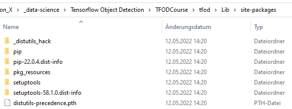
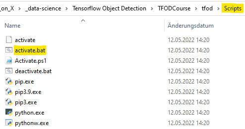
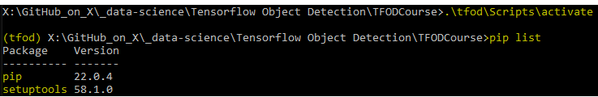

# Step-by-step guide to setting up and using TensorFlow's Object Detection API

This is a step-by-step tutorial/guide to setting up and using
**TensorFlow's Object Detection API** to perform **object detection in
images/video** on Windows. This guide explains, how to setup your
Windows environment correctly and how to install Tensorflow and the
Tensorflow Object Detection API

**Main Source**:
<https://tensorflow-object-detection-api-tutorial.readthedocs.io/en/latest/index.html>

## Target Software versions
-   OS: Windows, Linux
-   Python: 3.9
-   (any Python 3.x version should work, although this is not been
    tested)
-   TensorFlow: 2.5.0
-   MSVC (Mircosoft Visual Studio Compiler) 2019

For GPU support (see later in GPU Support (Optional Step)):
-   CUDA Toolkit: 11.2
-   CuDNN: 8.1.0

Or one of the combinations shown on the official TensorFlow side:
<https://www.tensorflow.org/install/source_windows>

# Steps overview
[1 Create Virtual Environment (optional)](#_Toc118295651)

[2 TensorFlow Installation](#_Toc118295652)

[3 Enable GPU Support (optional)](#_Toc118295653)

[4 TensorFlow Object Detection API Installation](#_Toc118295654)

[5 Install the TensorFlow Object Detection API](#_Toc118295655)

[6 Copy TFOD API scripts for model training, evaluation and exporting in
custom script folder](#_Toc118295656)

[7 Install LabelImg](#_Toc118295657)

# Create Virtual Environment (optional)
## Advantages
-   Isolates all python and library dependencies needed for the TFOD
    model
-   Ensures clean working environment
-   Does not conflict with all other already installed libraries and
    dependencies -\> no dependency conflicts
-   "Create separated room to work in"

## 1. Create new folder ```\[CUSTOM_MODEL_NAME\]\\venv``` for the virtual environment
## 2. Create the new virtual environment in the repo
> ```
> cd \[CUSTOM_MODEL_NAME\]\\venv
> python -m venv tfod-sticky-notes
> ```
> Virtual environment has it's own isolated packages under ```Lib/site-packages```
>
> 

## 3. To activate the virtual environment on windows, run the windows batch script in ```Scripts/activate```
> ```
> .\\tfod-sticky-notes\\Scripts\\activate
> ```
> 
>
> Now ```(tfod-sticky-notes)``` is visible and pip list only shows isolated packages ```(Lib/site-packages)``` in your environment
> 
>
> Deactivate environment with ```deactivate```

## 4. Update pip libraries and dependencies
> Ensure that we have latest resolvers and upgraded pip install app
> In virtual environment run:
> ```
> python -m pip install \--upgrade pip
> ```
