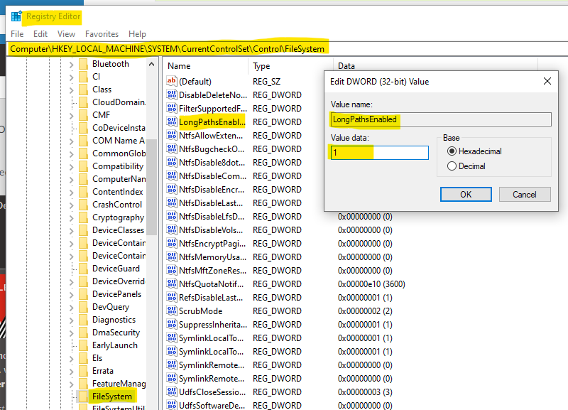
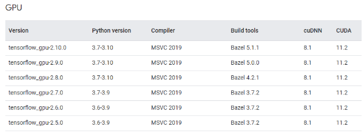
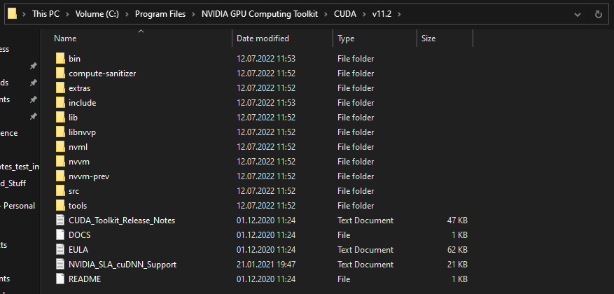
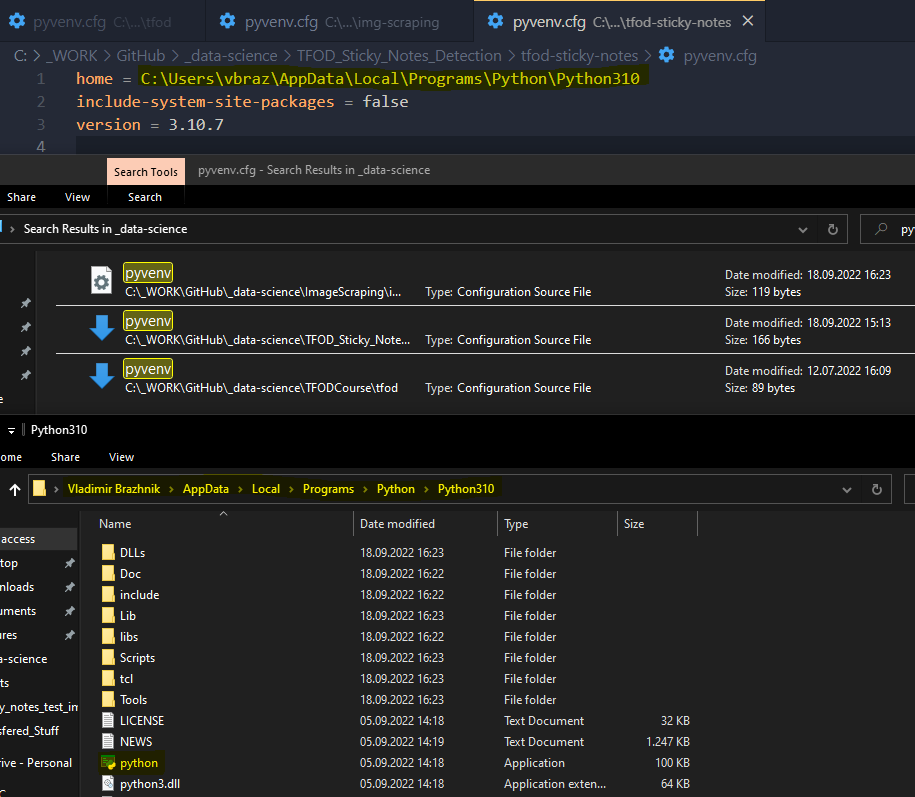
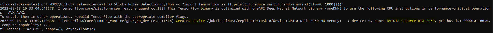

# Step-by-step guide to setting up and using TensorFlow's Object Detection API

This is a step-by-step tutorial/guide to setting up and using
**TensorFlow's Object Detection API** to perform **object detection in
images/video** on Windows. This guide explains, how to setup your
Windows environment correctly and how to install Tensorflow and the
Tensorflow Object Detection API

**Main Source**:
<https://tensorflow-object-detection-api-tutorial.readthedocs.io/en/latest/index.html>

## Target Software versions
-   OS: Windows, Linux
-   Python: 3.9
-   (any Python 3.x version should work, although this is not been
    tested)
-   TensorFlow: 2.5.0
-   MSVC (Mircosoft Visual Studio Compiler) 2019

For GPU support (see later in GPU Support (Optional Step)):
-   CUDA Toolkit: 11.2
-   CuDNN: 8.1.0

Or one of the combinations shown on the official TensorFlow side:
<https://www.tensorflow.org/install/source_windows>

# Steps overview
[I. Create Virtual Environment (optional)](#_Toc118295651)

[II. TensorFlow Installation](#_Toc118295652)

[III. Enable GPU Support (optional)](#_Toc118295653)

[IV. TensorFlow Object Detection API Installation](#_Toc118295654)

[V. Install the TensorFlow Object Detection API](#_Toc118295655)

[VI. Copy TFOD API scripts for model training, evaluation and exporting in
custom script folder](#_Toc118295656)

[VII. Install LabelImg](#_Toc118295657)

&nbsp;
&nbsp;
&nbsp;

# I. Create Virtual Environment (optional)
## Advantages
-   Isolates all python and library dependencies needed for the TFOD
    model
-   Ensures clean working environment
-   Does not conflict with all other already installed libraries and
    dependencies -\> no dependency conflicts
-   "Create separated room to work in"

## 1. Create new folder ```\[CUSTOM_MODEL_NAME\]\\venv``` for the virtual environment
## 2. Create the new virtual environment in the repo
> ```
> cd \[CUSTOM_MODEL_NAME\]\\venv
> python -m venv tfod-sticky-notes
> ```
> Virtual environment has it's own isolated packages under ```Lib/site-packages```
>
> 

## 3. To activate the virtual environment on windows, run the windows batch script in ```Scripts/activate```
> ```
> .\\tfod-sticky-notes\\Scripts\\activate
> ```
> 
>
> Now ```(tfod-sticky-notes)``` is visible and pip list only shows isolated packages ```(Lib/site-packages)``` in your environment
> 
>
> Deactivate environment with ```deactivate```

## 4. Update pip libraries and dependencies
> Ensure that we have latest resolvers and upgraded pip install app
> In virtual environment run:
> ```
> python -m pip install \--upgrade pip
> ```
 
&nbsp;
&nbsp;
&nbsp;

# II. TensorFlow Installation
> Tensorflow is the core deep learning library behind all object detenction functionality.
> 
> For it to work we need to install some dependencies.

## 1. Install TensorFlow PIP package
> ```pip install tensorflow```

> ### Possible LongPaths problem on windows
> **ERROR:** Could not install packages due to an OSError
> 
> **HINT:** This error might have occurred since this system does not have Windows Long Path support enabled.
> 
> **FIX**: Enable LongPaths on Windows
> 
> **SOURCE:** <https://www.howtogeek.com/266621/how-to-make-windows-10-accept-file-paths-over-260-characters/>
> 
> 

## 2. Install Visual C++ Build Tools:
> Visual C++ Build Tools are necessary for TensorFlow in order to run.
> 
> They can be downloaded under: <https://visualstudio.microsoft.com/vs/community/>

## 3. Verify your Installation
> ```
> python -c \"import tensorflow as
> tf;print(tf.reduce_sum(tf.random.normal(\[1000, 1000\])))\"
> ```
> Once above is run, follow print-out similar to one bellow should be seen:
> ```
> 2020-06-22 19:20:32.614181: W
> tensorflow/stream_executor/platform/default/dso_loader.cc:55\] **Could
> not load dynamic library \'cudart64_101.dll\'; dlerror: cudart64_101.dll
> not found**
> 
> 2020-06-22 19:20:32.620571: I
> tensorflow/stream_executor/cuda/cudart_stub.cc:29\] Ignore above cudart
> dlerror **if** you do **not** have a GPU set up on your machine.
>
> 2020-06-22 19:20:35.146285: W
> tensorflow/core/common_runtime/gpu/gpu_device.cc:1598\] Cannot dlopen
> some GPU libraries. Please make sure the missing libraries mentioned
> above are installed properly **if** you would like to use GPU. Follow
> the guide at https://www.tensorflow.org/install/gpu **for** how to
> download **and** setup the required libraries **for** your platform.
> 
> Skipping registering GPU devices\...
>
> 2020-06-22 19:20:35.196815: I
> tensorflow/core/common_runtime/gpu/gpu_device.cc:1108\]
>
> tf.Tensor(1620.5817, shape=(), dtype=float32)
> ```

&nbsp;
&nbsp;
&nbsp;

#  III. Enable GPU Support (optional)
> Enables significant faster model training and evaluating
> If machine is equipped with compatible CUDA-enabled GPU, it is recommended to install relevant libraries necessary to enable TensorFlow to make use of your GPU,
> because computational gains from GPU are substantial.
> By default, when TensorFlow is run it will attempt to register compatible GPU devices.
> If this fails, TensorFlow will resort to running on platform's CPU (can be observed in printout of console log).
> If GPU is not found or something didn't work out - number of messages report missing library files.
> (e.g. Could not load dynamic library \'cudart64_101.dll\'; dlerror: cudart64_101.dll not found).
> Install Appropriate CUDA and cuDNN version.
> Only necessary if you have GPU and you want to use GPU accelerated training.
> Enables GPU based acceleration when training TOD models.
> Reason for using GPU: it is exponentially faster to train OD model using GPU versus just using raw CPU and raw memory.


> **Source for all proper versions and configurations of dependencies provided by Tensorflow:**
>
> <https://www.tensorflow.org/install/source_windows>
>
>  


> **For TensorFlow to run on your GPU, following requirements must be met:**
>
>- Nvidia GPU (GTX 650 or newer)
>
>- Installed CUDA Toolkit v11.2
>
>- Installed CuDNN 8.1.0


> **IMPORTANT:**
> Important that tensorflow version matches cuDNN and CUDA version.
> If it don't match, it will still run but won't leverage your GPU.


> Extract the contents of the zip file (i.e. the folder named cuda)
> inside ```\<INSTALL_PATH\>\\NVIDIA GPU Computing Toolkit\\CUDA\\v11.2\\```,
> where ```\<INSTALL_PATH\>``` points to the installation directory specified during the installation of the CUDA Toolkit. 
> By default ```\<INSTALL_PATH\> = C:\\Program Files```.
> 
>  


## Environment Setup for GPU Support
> **Add the following paths to environment variables:**
> ```
> \<INSTALL_PATH\>\\NVIDIA GPU Computing Toolkit\\CUDA\\v11.2\\bin
> \<INSTALL_PATH\>\\NVIDIA GPU Computing Toolkit\\CUDA\\v11.2\\libnvvp
> \<INSTALL_PATH\>\\NVIDIA GPU Computing Toolkit\\CUDA\\v11.2\\include
> \<INSTALL_PATH\>\\NVIDIA GPU Computing Toolkit\\CUDA\\v11.2\\extras\\CUPTI\\lib64
> \<INSTALL_PATH\>\\NVIDIA GPU Computing Toolkit\\CUDA\\v11.2\\cuda\\bin **(does not exist)**
> ```

> ### Possible Python Path Error
> Adjust ```pyvenv.cfg``` python path inside virtual environment
> 
>  

## Verify the GPU support
> Run the following command in a new terminal:
> ```
> python -c \"import tensorflow as
> tf;print(tf.reduce_sum(tf.random.normal(\[1000, 1000\])))\"
> ```
> Once the above is run, you should see a print-out like the one bellow:
> ```
> 2021-06-08 18:28:38.452128: I
> tensorflow/stream_executor/platform/default/dso_loader.cc:53\]
> Successfully opened dynamic library cudart64_110.dll
>
> \...
> 
> 2021-06-08 18:28:40.973992: I
> tensorflow/core/common_runtime/gpu/gpu_device.cc:1733\] Found device 0
> **with** properties:
>
> pciBusID: 0000:02:00.0 name: GeForce GTX 1070 Ti computeCapability: 6.1
>
> coreClock: 1.683GHz coreCount: 19 deviceMemorySize: 8.00GiB
> deviceMemoryBandwidth: 238.66GiB/s
>
> 2021-06-08 18:28:40.974115: I
> tensorflow/stream_executor/platform/default/dso_loader.cc:53\]
> Successfully opened dynamic library cudart64_110.dll
>
> 2021-06-08 18:28:41.001094: I
> tensorflow/core/common_runtime/gpu/gpu_device.cc:1871\] Adding visible
> gpu devices: 0
>
> 2021-06-08 18:28:41.001651: I
> tensorflow/core/platform/cpu_feature_guard.cc:142\] This TensorFlow
> binary **is** optimized **with** oneAPI Deep Neural Network Library
> (oneDNN) to use the following CPU instructions **in**
> performance-critical operations: AVX AVX2
>
> To enable them **in** other operations, rebuild TensorFlow **with** the
> appropriate compiler flags.
>
> 2021-06-08 18:28:41.003095: I
> tensorflow/core/common_runtime/gpu/gpu_device.cc:1733\] Found device 0
> **with** properties:
>
> pciBusID: 0000:02:00.0 name: GeForce GTX 1070 Ti computeCapability: 6.1
>
> coreClock: 1.683GHz coreCount: 19 deviceMemorySize: 8.00GiB
> deviceMemoryBandwidth: 238.66GiB/s
>
> 2021-06-08 18:28:41.003244: I
> tensorflow/core/common_runtime/gpu/gpu_device.cc:1871\] Adding visible
> gpu devices: 0
>
> 2021-06-08 18:28:42.072538: I
> tensorflow/core/common_runtime/gpu/gpu_device.cc:1258\] Device
> interconnect StreamExecutor **with** strength 1 edge matrix:
>
> 2021-06-08 18:28:42.072630: I
> tensorflow/core/common_runtime/gpu/gpu_device.cc:1264\] 0
>
> 2021-06-08 18:28:42.072886: I
> tensorflow/core/common_runtime/gpu/gpu_device.cc:1277\] 0: N
>
> 2021-06-08 18:28:42.075566: I
> tensorflow/core/common_runtime/gpu/gpu_device.cc:1418\] Created
> TensorFlow device (/job:localhost/replica:0/task:0/device:GPU:0 **with**
> 6613 MB memory) -\> physical GPU (device: 0, name: GeForce GTX 1070 Ti,
> pci bus id: 0000:02:00.0, compute capability: 6.1)
>
> tf.Tensor(641.5694, shape=(), dtype=float32)
> ```
> 
> Notice from the highlighted console output in the image below, that the library files are now Successfully opened 
> and a debugging message is presented to confirmthat TensorFlow has successfully Created TensorFlow device.
> ```
> 
>  


&nbsp;
&nbsp;
&nbsp;

